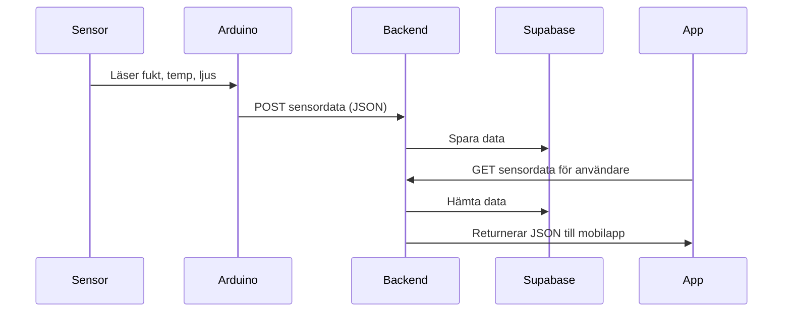

# ARCHITECTURE.md

## Översikt

Odlingskollen är ett IoT-baserat system som samlar in data från jordmiljöer (fukt, temperatur, ljus) och presenterar dessa i realtid i en mobilapplikation. Systemet består av tre huvudsakliga delar: IoT (hårdvara), backend (server & API), och frontend (mobilapp). Kommunikation sker huvudsakligen via HTTP och REST.

---

## Komponentöversikt

`IoT-sensorer → Arduino (mikrokontroller) → Node.js-backend → Supabase → React Native-app`

---

## 1. IoT-lager

### Plattform
- Arduino med PlatformIO  
- Programmeringsspråk: C++

### Funktion
- Samlar in data från:
  - Jordfuktighetssensor  
  - Temperaturgivare  
  - Ljusmätare  
  - Regnsensor  
- Skickar data via HTTP POST till backend-servern med JSON-payload  
- Sensoravläsningar sker med jämna intervall

### Begränsning
- NPK-sensorn togs bort på grund av kommunikationsproblem och bristfälligt dokumenterad databaspecifikation.

---

## 2. Backend

### Plattform
- Node.js + Express.js  
- Kördes initialt lokalt under utveckling med `npm run dev`, men utvecklades till en webhost

### Funktion
- Tar emot sensordata via REST-endpoints  
- Lagrar och hämtar data från Supabase (PostgreSQL)  
- Autentisering och användarhantering via Supabase  
- Tillhandahåller data till frontend via GET-requests (användarspecifik filtrering)

### API-dokumentation
Tillgänglig via SwaggerHub:  
https://app.swaggerhub.com/apis/chasacademy-5d1/app-arts_plant_api/1.0.0

---

## 3. Databas

### Plattform
- Supabase (PostgreSQL)

### Funktion
- Sparar mätdata för varje växt/enhet  
- Kopplar användare till sina växter och deras sensordata  
- Realtidsfunktioner via Supabase subscriptions (eventuellt under utveckling)

---

## 4. Frontend

### Plattform
- React Native + Expo  
- Programmeringsspråk: JavaScript

### Funktion
- Visar sensordata i realtid i mobilgränssnitt  
- Låter användare:
  - Logga in  
  - Lägga till, ta bort och namnge växter  
  - Se senaste värden och varningar  
- Kommunikation med backend sker via REST-API

### Design
- Färgval och layout anpassade för tydlighet i utomhusmiljö  
- Gränssnitt testat med Figma-prototyp

---

## Kommunikationsflöde

---

## Framtida förbättringar

- MQTT-stöd för effektivare realtidskommunikation  
- Mörkt läge och alternativt färgtema i mobilappen  
- Pushnotiser vid kritiska sensorvärden  
- Alternativ datalagring för offline-stöd

---

## Slutsats

Arkitekturen är modulär och skalbar. Varje komponent kan vidareutvecklas eller bytas ut utan att resten av systemet påverkas drastiskt. Projektet visar på ett fullt fungerande vertikalt flöde från fysisk sensor till användarens mobil.
